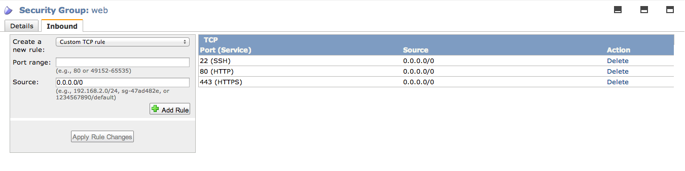
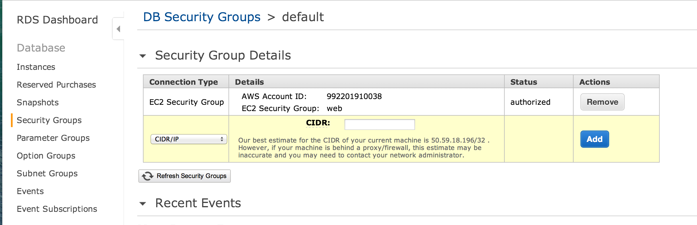

# Introduction

This chef cookbook setups an example [rails app](https://github.com/gosuri/rails-app) using the [AWS RDS](https://github.com/gosuri/aws-rds-cookbook) cookbook

# Requirements

* Git
* Chef 11.4+
* Ruby 1.9.3+
* AWS Credentials

## Non-Gem Dependencies

* [Vagrant 1.3.5+](http://www.vagrantup.com)
* [vagrant-aws 1.3.4](https://github.com/): Install using: 
  ```
  vagrant plugin install vagrant-aws
  ```
* [vagrant-berkshelf 1.3.4](https://github.com/berkshelf/vagrant-berkshelf): Install using 
  ```
  vagrant plugin install vagrant-berkshelf
  ```

## Usage

1. Clone the repo

   ```
   git clone https://github.com/gosuri/rails-app-cookbook.git
   cd rails-app-cookbook
   ```

2. Create the ```web``` EC2 security groups

   Create a security group called `web` and open 22 (SSH) and  80 (HTTP) ports.  It should be available at https://console.aws.amazon.com/ec2/home?region=us-east-1#s=SecurityGroups

   It'll look something like in the image below
   

3. Add ```web``` EC2 security to ```default``` RDS security group
   
   In order to make the rds instance available to the ec2 instance, you will need to add the ```web``` ec2 security group to ```default``` rds security group.  It should be available at https://console.aws.amazon.com/rds/home?region=us-east-1#securitygroup:ids=default

   It'll look something like this:
   

4. Place AWS credentials in ```.env``` file
   
   Place .env that contains your *AWS credentials* under ```.env```. You can use the sample ```.env.sample``` to get started

   ```
   cp .env.sample .env
   ```

   Edit ```.env``` and place your keys there

5. Install gem dependencies

   First you'll need bundler which can be installed with a simple `gem install bundler`. Afterwords, do the following:

   ```
   bundle install
   ```

6. Provision an AWS instance

   ```
   source .env && vagrant up --provider=aws
   ```

   If the provisioning fails you can restart it using ```vagrant provision```

7. Point your browser to the newly created ec2 instanstance and you should see 'It works!'

# Recipes

* ```default.rb```: The default recipe creates an rds instance and setups the rails app with unicorn and nginx

# Contributing

1. Fork the project on github
2. Commit your changes to your fork
3. Send a pull request

# License & Author

Author:: Greg Osuri (<gosuri@gmail.com>)

Copyright (c) 2013 Greg Osuri 

Licensed under the MIT License

Permission is hereby granted, free of charge, to any person obtaining a copy of this software and associated documentation files (the 'Software'), to deal in the Software without restriction, including without limitation the rights to use, copy, modify, merge, publish, distribute, sublicense, and/or sell copies of the Software, and to
permit persons to whom the Software is furnished to do so, subject to the following conditions:

The above copyright notice and this permission notice shall be included in all copies or substantial portions of the Software.

THE SOFTWARE IS PROVIDED 'AS IS', WITHOUT WARRANTY OF ANY KIND, EXPRESS OR IMPLIED, INCLUDING BUT NOT LIMITED TO THE WARRANTIES OF MERCHANTABILITY, FITNESS FOR A PARTICULAR PURPOSE AND NONINFRINGEMENT.  IN NO EVENT SHALL THE AUTHORS OR COPYRIGHT HOLDERS BE LIABLE FOR ANY CLAIM, DAMAGES OR OTHER LIABILITY, WHETHER IN AN ACTION OF CONTRACT, TORT OR OTHERWISE, ARISING FROM, OUT OF OR IN CONNECTION WITH THE SOFTWARE OR THE USE OR OTHER DEALINGS IN THE SOFTWARE.
